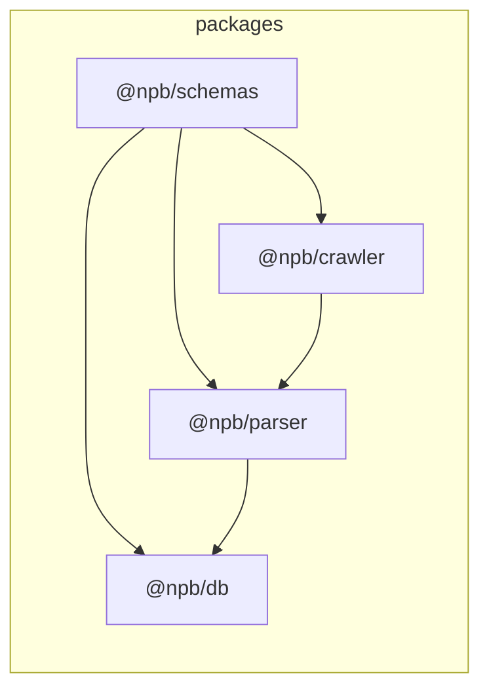

# ワークスペースのパッケージ構成

`packages/*` は pnpm の `workspace:*` プロトコルで互いに依存し、TypeScript の `paths` でソース解決を明示しています。

## パッケージの役割

| パッケージ | 役割（AGENTS.md 準拠） |
|------------|------------------------|
| `@npb/schemas` | 共有 Zod スキーマ（外部入力・パース境界など） |
| `@npb/crawler` | 試合の発見と raw HTML の取得 |
| `@npb/parser` | raw HTML から structured intermediate JSON へのパース |
| `@npb/db` | マイグレーション、ローダー、クエリ層（正規化 DB） |

## `workspace:*` 依存

`package.json` の `dependencies` に次のように記述します。

```json
"@npb/schemas": "workspace:*"
```

pnpm がワークスペース内の該当パッケージにリンクします。バージョンは常にモノレポ内の実体に一致します。

現在の依存関係:

- `@npb/schemas` — ワークスペース依存なし（外部は `zod` のみ）
- `@npb/crawler` → `@npb/schemas`
- `@npb/parser` → `@npb/schemas`, `@npb/crawler`
- `@npb/db` → `@npb/schemas`, `@npb/parser`

データの流れ（設計上の向き）に合わせ、下流ほど上流パッケージに依存します。循環参照はありません。

## TypeScript の `paths`

各パッケージの `tsconfig.json` で `baseUrl: "."` と `paths` を設定し、`@npb/*` が **`node_modules` 内のワークスペースリンク**（例: `./node_modules/@npb/schemas/src/index.ts`）へ解決されるようにしています。

pnpm が `workspace:*` でリンクを張ったあと、`tsc` はその実体（各パッケージの `src`）を読みにいきます。以前 `../schemas/src` のように sibling を直接指すと、`rootDir: "src"` と組み合わせた際に TS6059（解決先が `rootDir` 外）になるため、**`node_modules` 経由**に統一しています。

`scripts/typecheck.mjs` では依存順（`schemas` → `crawler` → `parser` → `db`）で `tsc` を実行しています。

## `exports` フィールド

各 `package.json` の `exports["."]` に `types` / `import` / `default` を並記し、型解決と ESM の入口を揃えています。

## 依存関係の図（設計上の向き）



- **実線の向き**: `package.json` の `workspace:*` 依存（下流が上流を import する想定）。
- **データの流れ**（AGENTS.md のパイプライン）: raw HTML 収集（crawler）→ structured JSON（parser）→ 正規化 DB（db）。共有の境界型・Zod は **schemas** に集約する。

## 関連ドキュメント

- [bootstrap.md](./bootstrap.md) — 初回セットアップとルートコマンド
